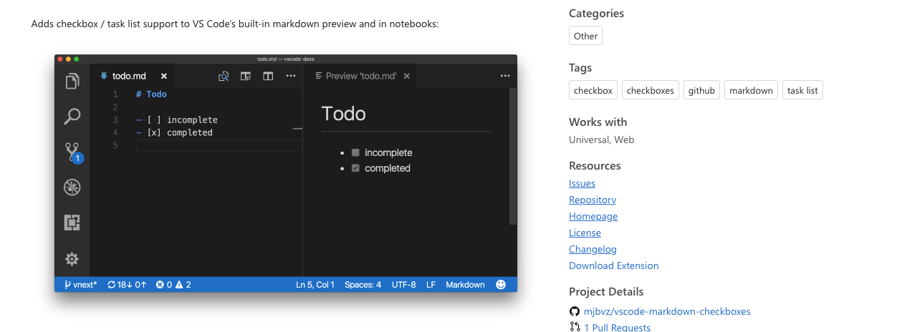

# Kubernetes Helm Chart for HashiCorp Vault with Auto-Unseal

This repository provides a Helm chart to deploy HashiCorp Vault on Kubernetes with the auto-unseal feature enabled. It includes a step-by-step guide to help users deploy, configure, and troubleshoot Vault in their Kubernetes environments, leveraging cloud-based auto-unseal mechanisms like Azure Key Vault, AWS KMS, and GCP KMS.

## Todo

- [ ]

:blush:

Whether you’re new to HashiCorp Vault or experienced but facing issues with auto-unseal on Kubernetes, this repository provides comprehensive documentation and an easily customizable Helm chart to simplify your deployment process.

Key Features:

- Seamless integration of HashiCorp Vault with Kubernetes
- Auto-unseal using cloud provider Key Management Services (KMS)
- Highly customizable Helm chart for various Kubernetes environments
- step-by-step guide for deployment and troubleshooting
- Preconfigured security best practices for production environments

Getting Started:

Check out the wiki for detailed instructions on deploying HashiCorp Vault with auto-unseal in your Kubernetes cluster.

Tags: kubernetes, hashicorp-vault, helm, autounseal, cloud-security, k8s, vault-kubernetes, helm-chart, devops, sre
