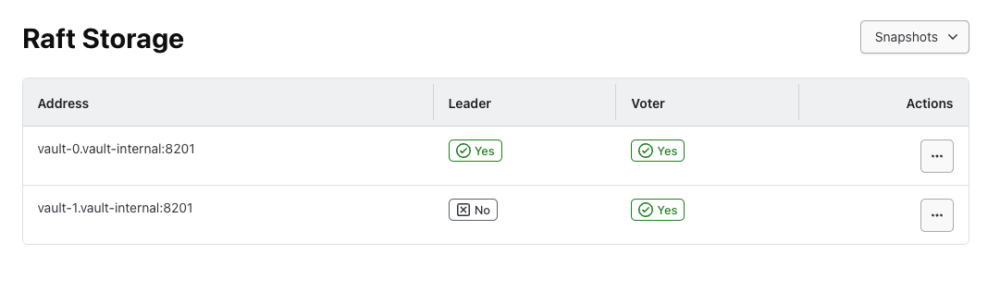

# Kubernetes Helm Chart for HashiCorp Vault with Auto-Unseal using WorkLoad Identity

This repository provides a Helm chart to deploy HashiCorp Vault on Kubernetes with the auto-unseal feature enabled. It includes a step-by-step guide to help users deploy, configure, and troubleshoot Vault in their Kubernetes environments, leveraging cloud-based auto-unseal mechanisms like Azure Key Vault, AWS KMS, and GCP KMS. .

## Assuming You Have

- [ ] A Kubernetes Cluster
- [ ] A KeyVault 
  - For Keeping Vault AutoUnseal
  - For Keeping vault Token & Unseal keys

`I like to keep Vault Root Token and Unseal keys inside a the Vault to be on the safe side as well.`

## What We will be covering : 
- [x] Enabling OIDC Issuer for Vault K8s Cluster
- [x] Creating a workload Identity i.e Managed Identities
- [x] Creating Federated Identity Credentials
- [x] Providiing Permissions to Workload Identity for autounseal
- [x] Create Key in Azure Key Vault
- [x] Installing Vault in HA mode with RAFT Storage
- [x] Testing Vault AutoUnseal Feature

We will setup using Azure, Other Cloud platforms follow the same process.

### Enable OIDC issuer for your Cluster

```bash
export CLUSTER_NAME="<YourClusterNameGoesHere>"
export RESOURCE_GROUP="<ClusterResourceGroup>"

#### Enable OIDC Issuer
az aks update \
    --resource-group "${RESOURCE_GROUP}" \
    --name "${CLUSTER_NAME}" \
    --enable-oidc-issuer \
    --enable-workload-identity

export IDENTITY_RESOURCE_GROUP="YourIdentityResourceGroupName"
export IDENTITY_NAME="IdentityName"
export IDENTITY_RESOURCE_GROUP="IdentityResourceGroup"
```

### Create a Workload Identity
You can Create Workload Identity in any Resource Group, Subscription.

```bash
export IDENTITY_NAME="<YourVaultName>" # This is your Managed Identity Name
export IDENTITY_RESOURCE_GROUP="<IdentityResourceGroup>" # This is your Resource Group where it will be created.

## Assuming you're already logged to your Azure Account and set your subscription if not do:
## Run az login and set your subscription.

# This will Create your managed Identity.
az identity create --name "${IDENTITY_NAME}" --resource-group "${IDENTITY_RESOURCE_GROUP}"
```

### Create a Federated Credetials

We will fetch `IDENTIY_CLIENT_ID` The identity created in last step.<br>
We will fetch the `SERVICE_ACCOUNT_ISSUER` This will be service account used by vault.

```bash
# Create Federated Credential
export SERVICE_ACCOUNT_NAME=vault # ℹ️ This is the default Kubernetes ServiceAccount used by the vault
export SERVICE_ACCOUNT_NAMESPACE=vault # ℹ️ This is the namespace for vault service account.
export SERVICE_ACCOUNT_ISSUER=$(az aks show --resource-group $RESOURCE_GROUP --name $CLUSTER_NAME --query "oidcIssuerProfile.issuerUrl" -o tsv)
export IDENTITY_CLIENT_ID=$(az identity show --name "${IDENTITY_NAME}" --resource-group "${IDENTITY_RESOURCE_GROUP}"  --query 'clientId' -o tsv)

# Create Federated Credential
az identity federated-credential create \
  --name "vault-manager-ops" \
  --identity-name "${IDENTITY_NAME}" \
  --resource-group "${IDENTITY_RESOURCE_GROUP}" \
  --issuer "${SERVICE_ACCOUNT_ISSUER}" \
  --subject "system:serviceaccount:${SERVICE_ACCOUNT_NAMESPACE}:${SERVICE_ACCOUNT_NAME}"
```
This should appear in your managed identities like this.

### Assing the Role Key Vault Crypto officer
Now you need to assign the role to your managed Identity

- Using cli

```bash
# Get Client ID
export IDENTITY_CLIENT_ID=$(az identity show --name "${IDENTITY_NAME}" --resource-group "${IDENTITY_RESOURCE_GROUP}"  --query 'clientId' -o tsv)

# Assign the Role make sure to put your subscription and vault name
az role assignment create \
  --role "Key Vault Crypto Officer" \
  --assignee $IDENTITY_CLIENT_ID \
  --scope /subscriptions/${SUBSCRIPTION_ID}/resourceGroups/${IDENTITY_RESOURCE_GROUP}/providers/Microsoft.KeyVault/vaults/${VAULT_NAME}
```
- Using the Azure Portal


### Create an RSA Key in Azure Key Vault
- You can use cli to create this key
```bash
# This will create the key for you
az keyvault key create \
  --vault-name <YourKeyVaultName> \
  --name vault-auto-unseal \
  --kty RSA \
  --size 2048
``` 
- or the UI interface like this


### Pull the Latest Vault helm Chart
I like to create my own helm charts and pull relevant versions and keep them in my repository instead of deploying from the online helm chart repository.

```bash
# add repository
helm repo add hashicorp https://helm.releases.hashicorp.com

# Just to check version at the time of writing this document
helm search repo hashicorp/vault
NAME                            	CHART VERSION	APP VERSION	DESCRIPTION                          
hashicorp/vault                 	0.28.1       	1.17.2     	Official HashiCorp Vault Chart       
hashicorp/vault-secrets-operator	0.8.1        	0.8.1      	Official Vault Secrets Operator Chart

# pull the helm chart
helm pull hashicorp/vault

# unpack the helm chart
tar -xvf vault-0.28.1.tgz

# clean the repo
rm -rf vault-0.28.1.tgz
```

### Chart Values Explanation
I have cherry picked the values file so its easier to understand.

- Set these to default name your release name as these will be used in the raft auto leader election.

```YAML
global:
  namespace: "vault"
```

- Your Ingress Configuration obviously you would like to have the UI
```yaml
server:
  # Ingress Configuration
  ingress:
    enabled: true
    annotations:
      cert-manager.io/cluster-issuer: "letsencrypt" # If you've setuped cert manager
      cert-manager.io/common-name: "vault.<yourorganization>.com" # If you've setuped cert manager
    ingressClassName: "nginx"
    activeService: true
    hosts:
      - host: vault.yourorganization.com
        paths: []
    tls:
      - secretName: <yourorganizatio>n-tls
        hosts:
          - vault.<yourorganization>.com
```

- Extra labels to be attached to your pod
```YAML
server:
  # Extra labels to attach to the server pods
  # This should be a YAML map of the labels to apply to the server pods  
  extraLabels:
    azure.workload.identity/use: "true"
```  

- Making your vault HA, with Replicas and RAFT Mode.
```YAML
server:
  ha:
    enabled: true
    replicas: 3
    raft:
      enabled: true
      setNodeId: true
      config: |
        ui = true
        listener "tcp" {
          address = "0.0.0.0:8200"
          cluster_address = "0.0.0.0:8201"
          tls_disable = 1
        }
        storage "raft" {
          path = "/vault/data"

          retry_join {
          leader_api_addr = "http://vault-0.vault-internal:8200"
          }
          retry_join {
          leader_api_addr = "http://vault-1.vault-internal:8200"
          }
          retry_join {
          leader_api_addr = "http://vault-2.vault-internal:8200"
          }                    
        }
        seal "azurekeyvault" {
          vault_name = "<YourKeyVaultName>"
          key_name   = "vault-unseal-key"
          client_id  = "XXXXXXXX-cd79-4859-858d-XXXXXXX"
        }
        
        service_registration "kubernetes" {}     
```

- Data Storage
```YAML
server:
  dataStorage:
    enabled: true
    # Size of the PVC created
    size: 10Gi
```

- Service Account Definition, This is the place where you want to use your federated Identity.
```YAML
server:
  # Definition of the serviceAccount used to run Vault.
  # These options are also used when using an external Vault server to validate
  # Kubernetes tokens.
  serviceAccount:
    create: true
    name: "vault"
    createSecret: false
    # Extra annotations for the serviceAccount definition.
    annotations:
      azure.workload.identity/client-id: "XXXXXXXX-cd79-4859-858d-XXXXXXX"
     # This should be a YAML map of the labels to apply to the serviceAccount 
    extraLabels:
      azure.workload.identity/use: "true"
    serviceDiscovery:
      enabled: true
```

I have Attahed all the Values file ready for you in `values-vault.yaml`.

### Deploy the Helm Chart i.e Vault Cluster
```bash
# Create the namespace
helm create ns vault

# Deploy the helm chart
helm upgrade --install vault ./vault -f values-vault.yaml -n vault
```

### Initializing vault

With the below initialization we split the root key into 3 shares (unseal keys). We can also set how many keys are required to reconstruct the root key, which is then used to decrypt the Vault’s encryption key.
```bash
kubectl exec vault-0 -n vault -- vault operator init \
    -key-shares=3 \
    -key-threshold=2 
```    
Once is applied Vault generates unseal keys encrypted with base64 and hex and root token responsible for authentication against Vault. We will use it later.

```BASH
Recovery Key 1: FFMLznSZq9wh/0CJwKLJWKkI9BrK/hjF6ySDYl9a19Ie
Recovery Key 2: qRfrdpkuEcXsF+dFh1Geru8VHkiL/hWUW+vY25twlwT1
Recovery Key 3: dX8sed7Dv8kI8kfFuYWDeQlagoikEVBpV5lZqH4ORnEh

Initial Root Token: XxxxxxxxxXXXXxxxxxxx

Success! Vault is initialized
```
and check its status to verify Sealed status.

```bash
kubectl exec -it vault-a -n vault -- vault status

Key                      Value
---                      -----
Seal Type                azurekeyvault
Recovery Seal Type       shamir
Initialized              true
Sealed                   false
Total Recovery Shares    3
Threshold                2
Version                  1.17.2
Build Date               2024-07-05T15:19:12Z
Storage Type             raft
Cluster Name             vault-cluster-eb895a69
Cluster ID               8c5ede42-c7ef-4575-2be7-84c043bd4acc
HA Enabled               true
HA Cluster               https://vault-0.vault-internal:8201
HA Mode                  active
Active Since             2024-08-28T22:50:14.894551442Z
Raft Committed Index     11203670
Raft Applied Index       1120366
```

#### Congrats You've Enabled Deployed Vault in HA mode with Raft Storage and your AutoUnseal is working as expected.
